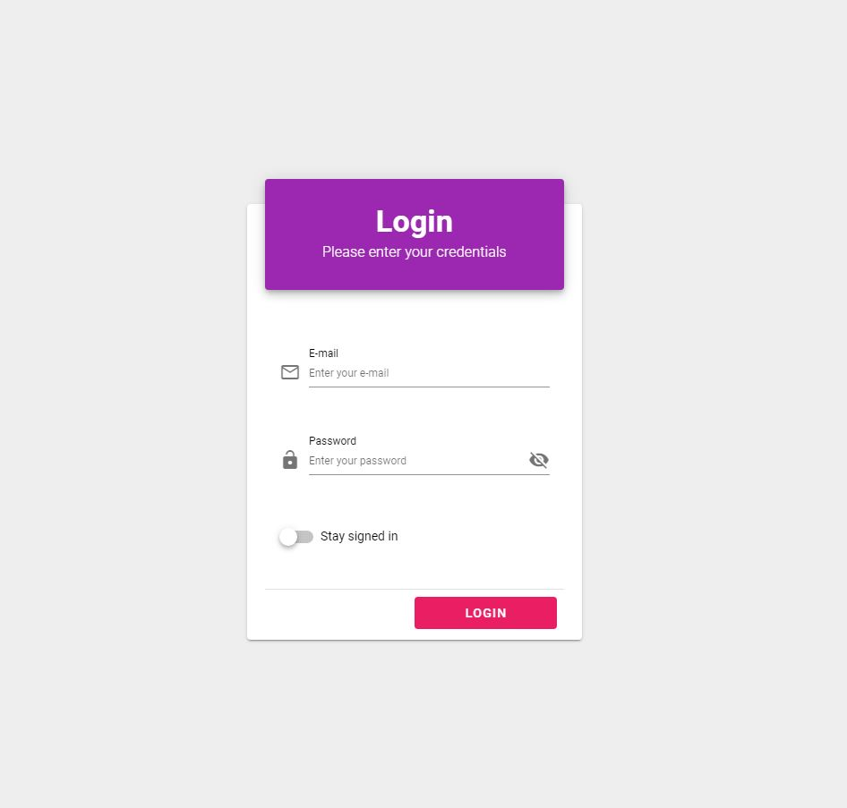
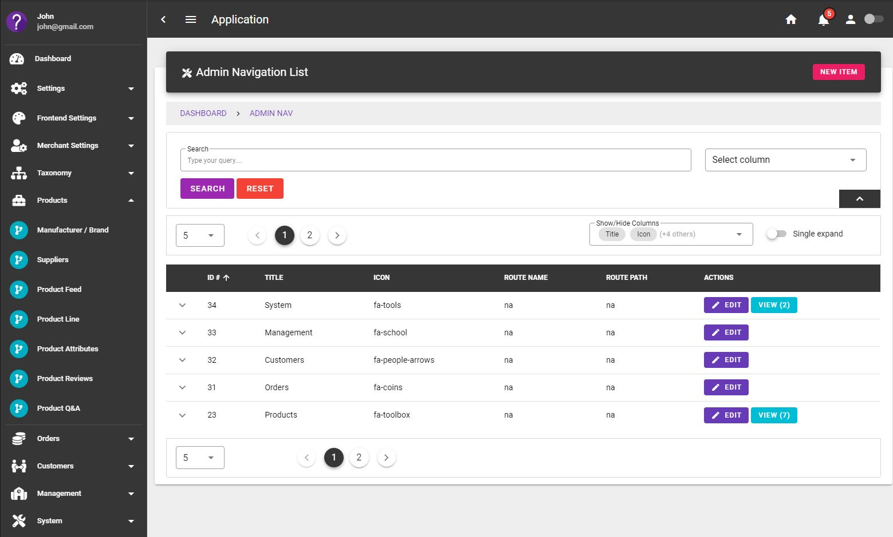
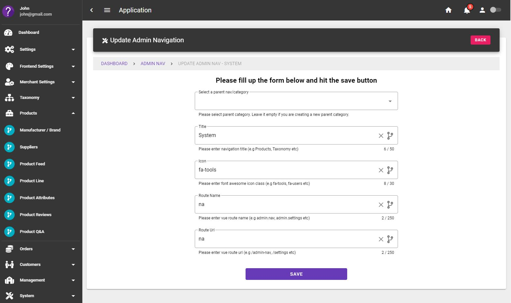

# Modular development using Laravel packages 

### Demo

  
 
  
 
  

> Requirements: php 7.4, laravel v8

- Base
- Api Exception
- Admin Auth
- Admin Vue UI
- Admin Navigation

### TODO's
- Taxonomy
- Product Feed
- Product
- Product Attributes & Combos
- Cart
- Payment Gateway API
- CMS
- CRM
- Orders
- Sales
- Dispatch 
- Courier Services & API
- CRUD Generator
- Ebay Trading API
- Amazon Seller API

Each package will be an individual branch.

> Note: The project is under development. 